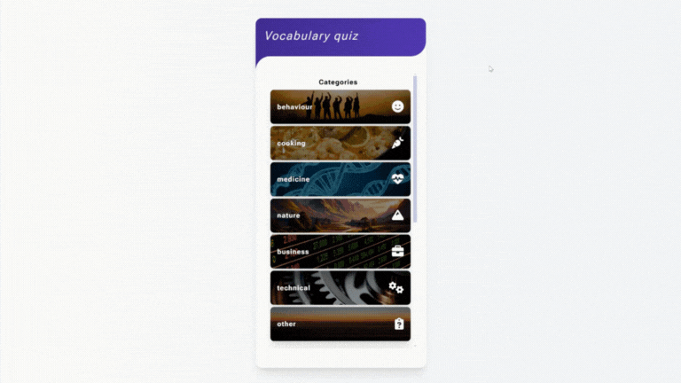

# Vocabulary Quiz

## Preview

**[www.vocabularyquiz.lukaszsliwinski.pl](http://www.vocabularyquiz.lukaszsliwinski.pl)**

## About project

This is my side-project that I made to improve web programming using Angular framework. The application helps me learn english vocabulary after lessons.

## Features

- app get list of categories from database and render categories on main page
- after selecting a category, app get random 10 words or phrases from chosen category
- for each word, the user provides a translation and checks its correctness
- after the last answer, the result is given

## Technologies used

### front-end
- TypeScript
- Angular
- SCSS

### back-end
- JavaScript
- Node.js
- Express.js
- MongoDB
